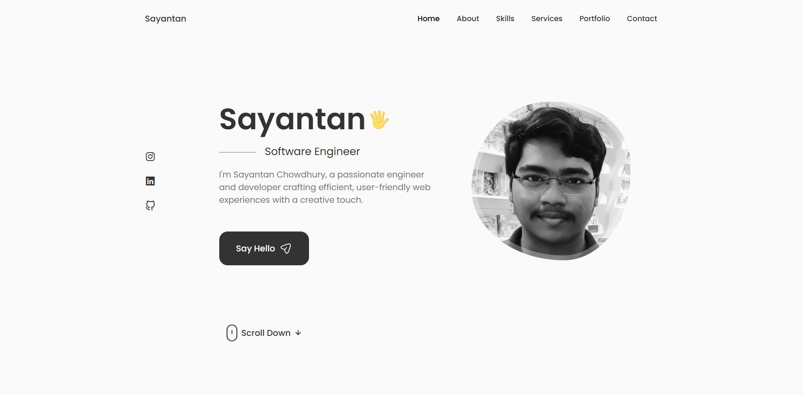

# Personal Portfolio Website



A modern, minimalistic portfolio website showcasing my skills in frontend development, backend services, and data analysis. Built with performance and user experience in mind.

## Features

- **Responsive Design**: Fully responsive layout that works seamlessly across desktop, tablet, and mobile devices
- **Light/Dark Theme**: Toggle between day and night modes for comfortable viewing
- **Optimized Performance**: Lazy loading, optimized assets, and efficient code structure for fast loading times
- **Interactive UI**: Smooth animations and transitions for an engaging user experience
- **Modular Architecture**: Clean, maintainable code structure designed for scalability

## Sections

- **Header**: Navigation and introduction
- **About**: Professional background and personal information
- **Skills**: Technical competencies with visual indicators
- **Qualifications**: Education and work experience timeline
- **Services**: Professional services offered
- **Projects**: Portfolio of completed work with descriptions and links
- **Testimonials**: Client and colleague feedback
- **Contact**: Form for sending messages directly from the website

## Technologies Used

- **Frontend**:
  - HTML5, CSS3, JavaScript (ES6+)
  - ReactJS
  - SwiperJS for carousels
  - EmailJS for contact form functionality
  - CSS Variables for theming
  - Responsive design principles

- **Development Tools**:
  - Vite for fast development and optimized builds
  - Git for version control
  - npm for package management

## Getting Started

### Prerequisites

- Node.js (v14.0.0 or higher)
- npm (v6.0.0 or higher)

### Installation

1. Clone the repository
```bash
git clone https://github.com/yourusername/Sayantan-Portfolio.git
```

2. Navigate to the project directory
```bash
cd Sayantan-Portfolio
```

3. Install dependencies
```bash
npm i
```

4. Start the development server
```bash
npm run dev
```

5. Open your browser and visit `http://localhost:5173`

## Building for Production

```bash
npm run build
```

This will generate optimized files in the `dist` folder that can be deployed to any static hosting service.

## Project Structure

```
Sayantan-Portfolio/
├── public/
│   |
│   └── assets/
├── src/
│   ├── components/
│   │   ├── Header/
|   |   ├── Home/
│   │   ├── About/
│   │   ├── Skills/
│   │   ├── Qualification/
│   │   ├── Services/
│   │   ├── Work/
│   │   ├── Testimonials/
|   |   ├── Contact/
|   |   ├── ScrollUp/
│   │   └── Footer/
|   |   
|   |
│   ├── App.css
│   ├── App.jsx
│   ├── main.jsx
│   └── index.css
├── .gitignore
├── package.json
├── vite.config.js
└── README.md
```

## Customization

### Changing Theme Colors

Theme colors can be modified in `src/App.css` by updating the CSS variables.

### Adding Projects

Add new projects by modifying the projects data in `src/components/Work/Data.jsx`.

### Adding Testimonials

Add or update testimonials in `src/components/Testimonials/Data.jsx`.

## Deployment

This portfolio can be deployed on any static site hosting service:

- Netlify
- Vercel
- GitHub Pages
- Firebase Hosting

## License

This project is licensed under the MIT License - see the LICENSE file for details.

## Contact

Sayantan - [chowdhurysayantan935@gmail.com](mailto:chowdhurysayantan935@gmail.com)

Project Link: [https://github.com/Sayan-2054/Sayantan-Portfolio](https://github.com/sayan-2054/Sayantan-Portfolio)

---

Made by Sayantan
